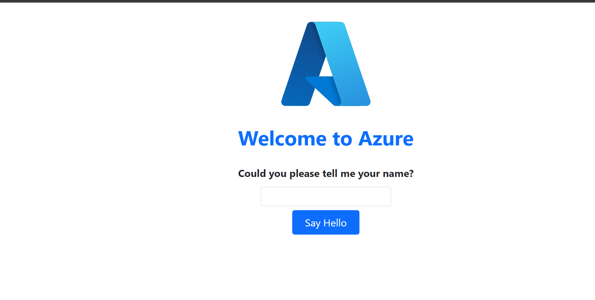

## Deploying a python-flask application in Azure App Service using CLI from Windows

### Pre-requisites:

* First of all, we need a sample python project which can be deployed to Azure App Services
* Request you to follow the below mentioned Repository as it has been updated
* Follow the latest and updated **_[py-flask App](https://github.com/Prozects/msdocs-python-flask-webapp-quickstart.git)_**

### Configurations:

1. Create a new directory from powershell C:\tmp\azureappdemo and cd into it
```
mkdir C:\tmp\azureappdemo
cd C:\tmp\azureappdemo
```

2. Now, clone the code locally into your system
```
git clone https://github.com/Prozects/msdocs-python-flask-webapp-quickstart.git
```
```
cd msdocs-python-flask-webapp-quickstart
```

3. Check if the python already exists in your system, If not found in your local m/c, kindly install it from an Elevated terminal using chocolatey
```
python --version
```

4. Next, after python installation & confirmation, create a virtual environment which is specific to the python application
```
py -m venv .venv
```

5. Activate the virtual environment
```
.\.venv\scripts\Activate.ps1
```

6. Install Flask
```
pip install -r requirements.txt
```

### Login into Azure CLI:
```
az login
```

* Unsure about further commands or lost with commandline
```
az webapp --help
```

* Check for all the installed runtimes (what all technologies that are supported)
```
az webapp list-runtimes
```

* We got the following o/p
```json
{
  "linux": [
    "DOTNETCORE:8.0",
    "DOTNETCORE:7.0",
    "DOTNETCORE:6.0",
    "NODE:18-lts",
    "NODE:16-lts",
    "PYTHON:3.11",
    "PYTHON:3.10",
    "PYTHON:3.9",
    "PYTHON:3.8",
    "PHP:8.2",
    "PHP:8.1",
    "PHP:8.0",
    "JAVA:17-java17",
    "JAVA:11-java11",
    "JAVA:8-jre8",
    "JBOSSEAP:7-java17",
    "JBOSSEAP:7-java11",
    "JBOSSEAP:7-java8",
    "TOMCAT:10.0-java17",
    "TOMCAT:10.0-java11",
    "TOMCAT:10.0-jre8",
    "TOMCAT:9.0-java17",
    "TOMCAT:9.0-java11",
    "TOMCAT:9.0-jre8",
    "TOMCAT:8.5-java11",
    "TOMCAT:8.5-jre8"
  ],
  "windows": [
    "dotnet:8",
    "dotnet:7",
    "dotnet:6",
    "ASPNET:V4.8",
    "ASPNET:V3.5",
    "NODE:18LTS",
    "NODE:16LTS",
    "java:1.8:Java SE:8",
    "java:11:Java SE:11",
    "java:17:Java SE:17",
    "java:1.8:TOMCAT:10.0",
    "java:11:TOMCAT:10.0",
    "java:17:TOMCAT:10.0",
    "java:1.8:TOMCAT:9.0",
    "java:11:TOMCAT:9.0",
    "java:17:TOMCAT:9.0",
    "java:1.8:TOMCAT:8.5",
    "java:11:TOMCAT:8.5",
    "java:17:TOMCAT:8.5"
  ]
}
```

* Let's bring up the Azure App Service with some appservice plan
```
az webapp up --runtime PYTHON:3.9 --sku F1 --logs
```

> '--sku' F1=Free Plan, B1=Basic Plan

> '--logs' where we can see the logs of this application

* If the deployment is successful, we get the following output in the terminal


* Navigate to the url



## References

> _**[Deploy a Python (Django or Flask) web app to Azure App Services from Windows](https://learn.microsoft.com/en-us/azure/app-service/quickstart-python?tabs=flask%2Cwindows%2Cazure-cli%2Cazure-cli-deploy%2Cdeploy-instructions-azcli%2Cterminal-powershell%2Cdeploy-instructions-zip-azcli)**_

> _**[Deploy the same application on Linux/MAC](https://learn.microsoft.com/en-us/azure/app-service/quickstart-python?tabs=flask%2Cmac-linux%2Cazure-cli%2Cazure-cli-deploy%2Cdeploy-instructions-azcli%2Cterminal-bash%2Cdeploy-instructions-zip-azcli)**_

> _**[More 'az webapp up' cli options](https://learn.microsoft.com/en-us/cli/azure/webapp?view=azure-cli-latest#az-webapp-up){:target="_blank"}**_